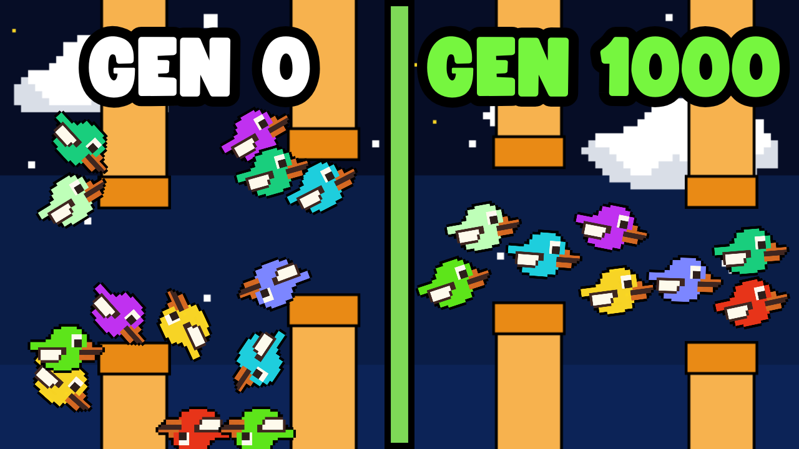

## 📢 Sigue el proyecto CodeDog
¡Bienvenido a este repositorio! 👋  
Aquí encontrarás el código utilizado en uno de los videos del proyecto **CodeDog** 🐶💻, donde exploramos conceptos fascinantes del mundo de las **Ciencias de la Computación** de forma clara y práctica, incluyendo temas como:
- 🤖 **Machine Learning**
- 🧠 **Inteligencia Artificial**
- 🧬 **Inteligencia Computacional**
- 💻 **Programación**

Si te interesa aprender más sobre estos temas y apoyar el contenido, no olvides seguirnos en nuestras redes sociales:
- ▶️ **[YouTube](https://www.youtube.com/channel/UCc6iP4H2xYFXYGkSx9Xtmig)**
- 🎵 **[TikTok](https://www.tiktok.com/@code.dog?_r=1&_t=ZS-93R2fwIZ9rI)**

¡Gracias por visitar el repositorio y feliz programación! 🚀🐾


# 🎮 Entrenando una IA para jugar videojuegos
Este repositorio contiene el codigo usado en el video [YYY](), en el cual se explica como entrenar una IA para jugar videojuegos. En el video programamos un video juego, diseñamos un sistema con una neurona y la entrenamos usando algoritmos geneticos.



## Descripción de archivos
Encontraras los siguientes archivos:
 - [experimento_v1.py](experimento_v1.py): primer experimento mostrado en el video con la versión base del juego
 - [experimento_v2.py](experimento_v2.py): segundo experimento con la versión más dificil del juego
 - [imgs](imgs): carpeta con todas las imagenes y sprites necesarias para correr el juego

## Instalación
Descarga o clona este proyecto:
```bash
git clone https://github.com/codedog-videos/Entrenando-IA-para-jugar-videojuegos.git
```

cambia el directorio a la carpeta descargada:
```bash
cd Entrenando-IA-para-jugar-videojuegos
```

utitliza las siguientes instrucciones para correr algun experimento:
```bash
python experimento_v1.py
```

```bash
python experimento_v1.py
```
